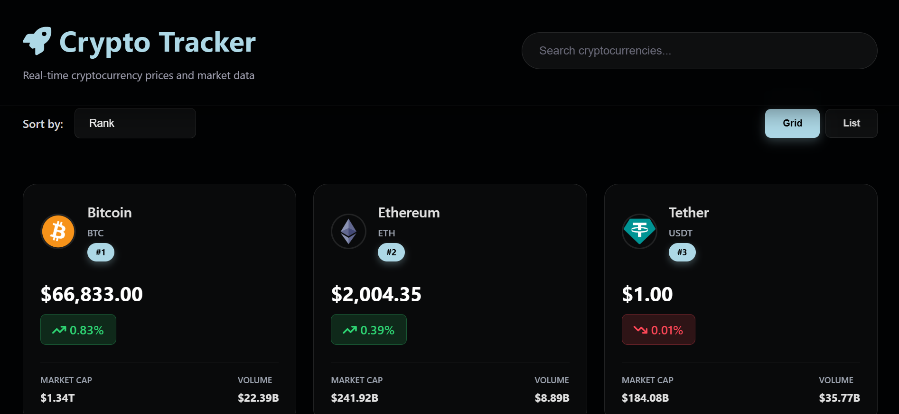
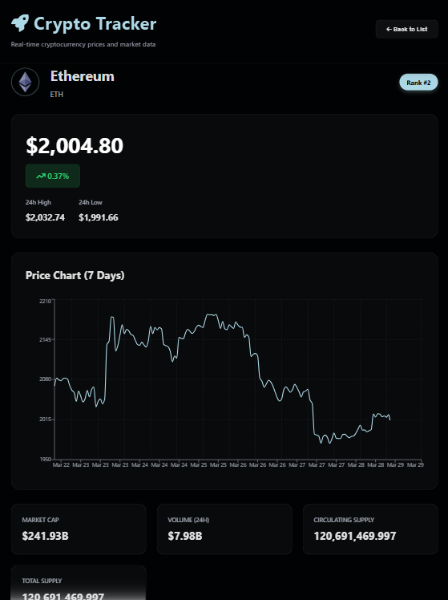

# 💰 CoinMetrics

A React-based cryptocurrency dashboard that displays real-time data for various cryptocurrencies including price, market cap, and trends.

## 🌐 Live Demo

https://crypto-price-viewer-8kxc.onrender.com/

## 💡 Why I Built This

I built this project to improve my React skills and learn how to work with external APIs, manage state, and display dynamic data in a clean and responsive UI.

## 🚀 Features

- 📊 View real-time cryptocurrency prices
- 🔍 Search and filter coins instantly by rank, price, market cap, and more
- 📈 View 24h price change percentages
- ⚡ Fast and responsive interface
- 🌐 Data fetched from CoinGecko API

## ⚛️ React Concepts Used

- useState & useEffect hooks
- Component-based architecture
- API data fetching
- Conditional rendering

## 🛠️ Tech Stack

- React
- JavaScript (ES6+)
- CSS
- Fetch API
- CoinGecko API

## 📸 Screenshots

## ⚙️ Installation

1. Clone the repository:
   git clone https://github.com/PaulEmmanuel8888/Crypto-Price-Viewer.git

2. Navigate into the project folder:
   cd crypto-price-viewer

3. Install dependencies:
   npm install

4. Start the development server:
   npm run dev

## 🌍 API Used

- CoinGecko API

## 📖 Usage

- Browse the list of cryptocurrencies
- Use the search bar to find specific coins
- View real-time price, market data, and dynamic charts

## 🔮 Future Improvements

- User authentication & watchlist
- Dark/light mode toggle
- Portfolio tracking feature

## 🤝 Contributing

Contributions are welcome! Feel free to fork this repo and submit a pull request.

## 📜 License

This project is licensed under the MIT License.
